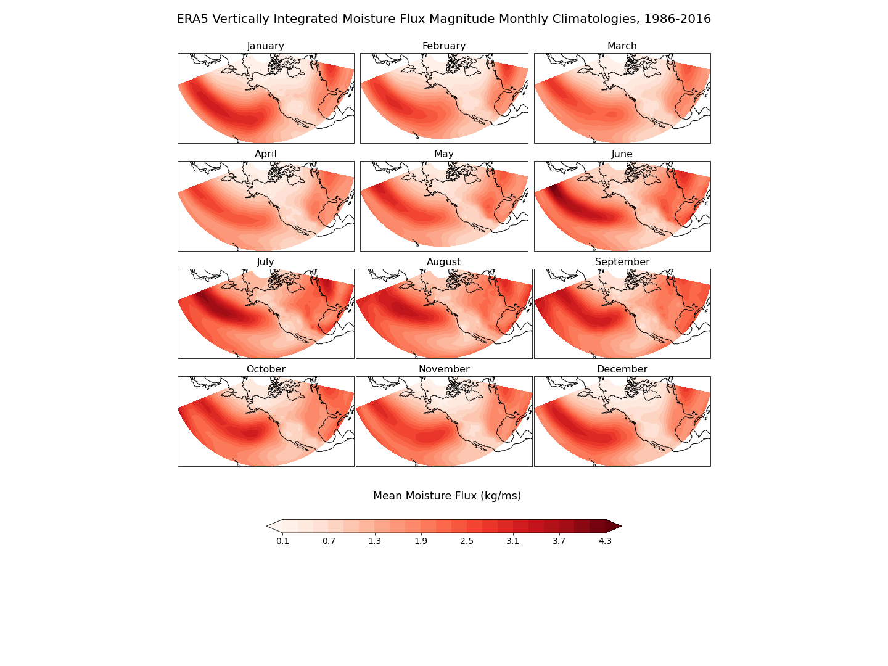
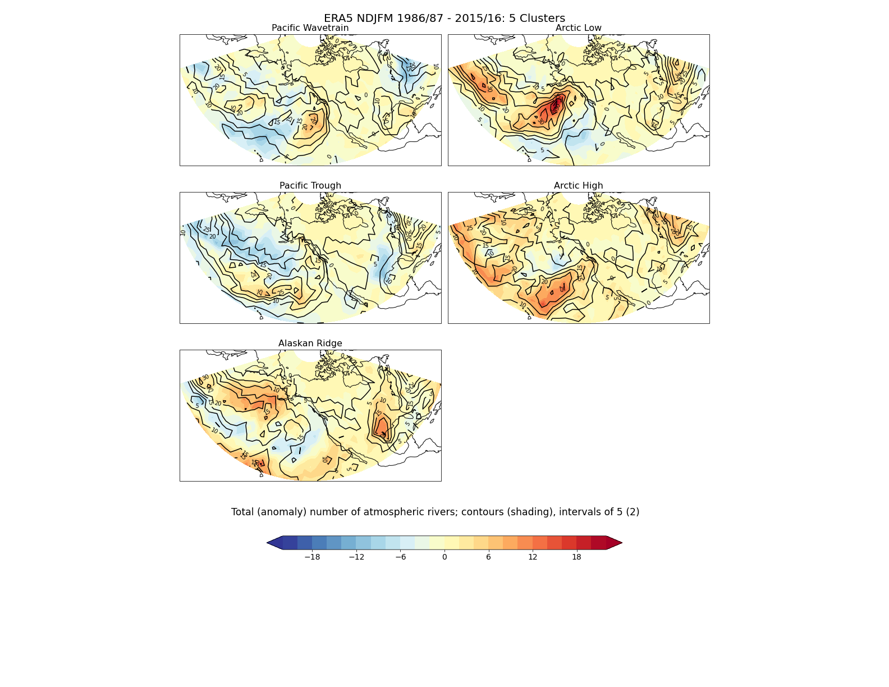
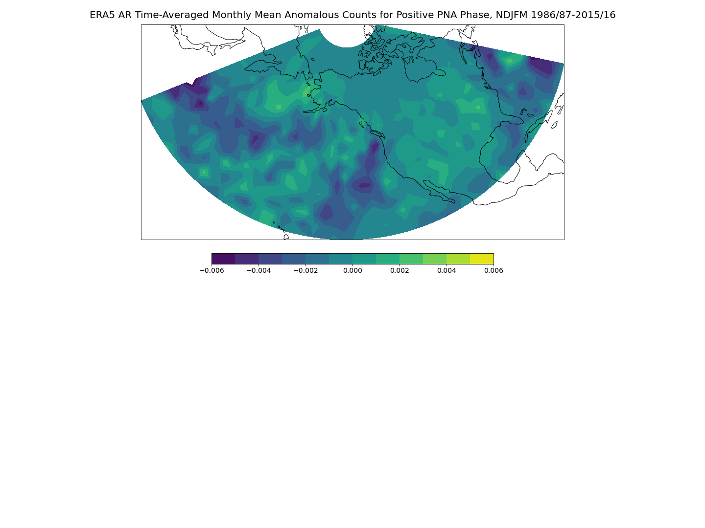

## Rivers in the Sky: Exploring Wintertime Moisture Flux over Pacific-North America

## Mary Korendyke

## Introduction

Here is where I talk about why I'm doing what I'm doing. Atmospheric rivers: what are they? Why are they important for long-term forecasting?

## Data

ERA5 reanalysis and Metis199 and Metis639. ERA5 provides winds and specific humidity at x levels, so that vertically integerated moisture flux must be calculated using the same levels as exist in the EMCWF model used to create Metis forecasts. Metis forecasts come with column-integrated moisture flux already calculated. Include native grid resolutions in km. All data is interpolated to a Gaussian grid (128x64?), in km.

Link to ERA5 site
Link to Metis site

## Results/Code
- discuss how atmospheric rivers are measured (algorithm), link to AR identification from metisregimes project

### Climatology
- year-round vertically integrated moisture flux climatology for ERA5

[Monthly Climatology of ERA5 Vertically Integrated Moisture Flux](https://github.com/mkorendyke/CLIM680/blob/master/hw2.ipynb)
[Identifying Atmospheric Rivers in ERA5 and Metis Data](https://github.com/mkorendyke/CLIM680/blob/master/AR_notrack_2.ipynb)
[Calculating Climatology and Anomalies of PacNA Atmospheric Rivers, 1986-2015, NDJFM](https://github.com/mkorendyke/CLIM680/blob/master/AR_notrack_3.calcanoms.ipynb)

### Winter-time Cluster Anomalies
- extended winter AR anoms for k=5 clusters ERA5

[Assign AR Anomalies to Regimes](https://github.com/mkorendyke/CLIM680/blob/master/AR_notrack_4.assign_clusters.ipynb)
[Plot Regime AR Anomaly Composites](https://github.com/mkorendyke/CLIM680/blob/master/AR_notrack_5.plot_composites.ipynb)

- significant differences in Metis anoms from ERA5 for extended winter AR k=5

### Atmospheric Rivers, the PNAI, and Nino3.4
- ERA5 PNA climate index

[ERA5 November to March Atmospheric River Anomalies Composited on the Pacific North America Index](https://github.com/mkorendyke/CLIM680/blob/master/hw3.ipynb)

- Correlate ERA5 with Nino3.4
- Regress ERA5 with Nino3.4

## Summary
What have I learned? What do the results show? Is there anything particularly interesting?
