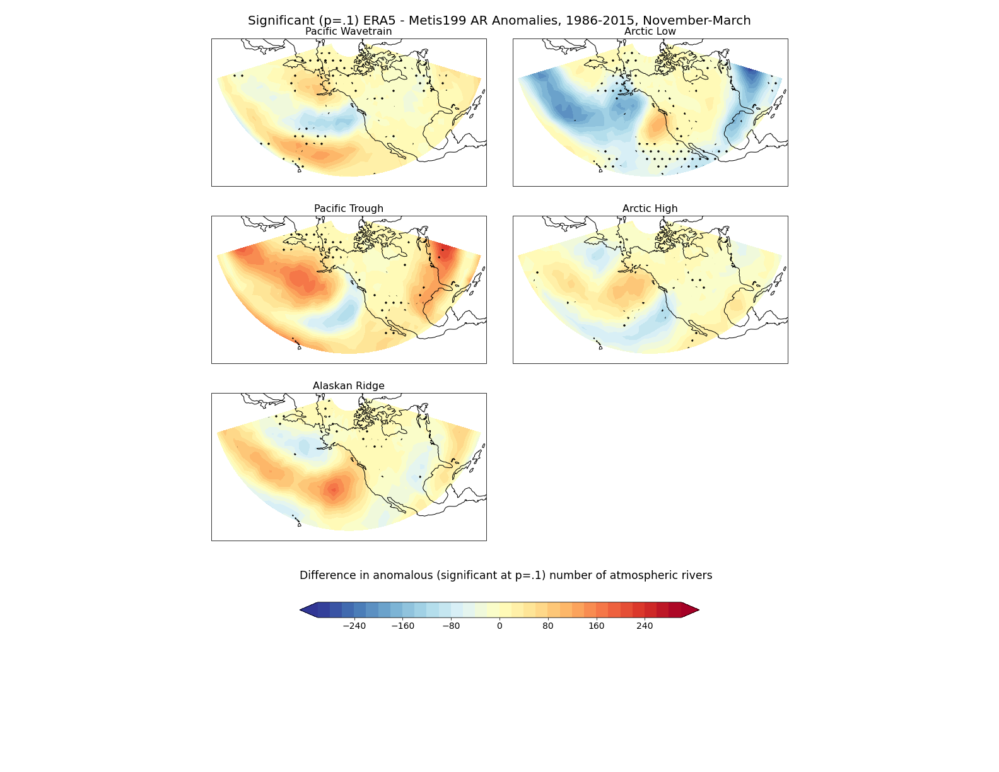
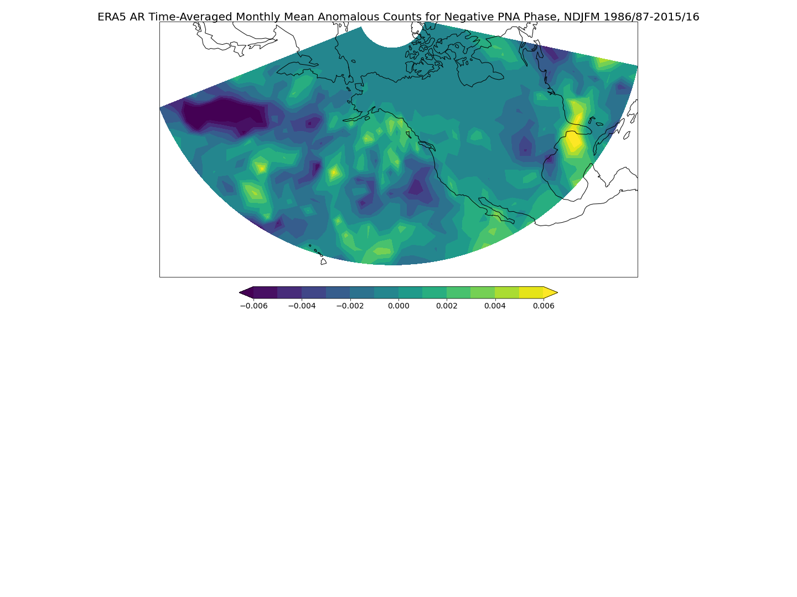
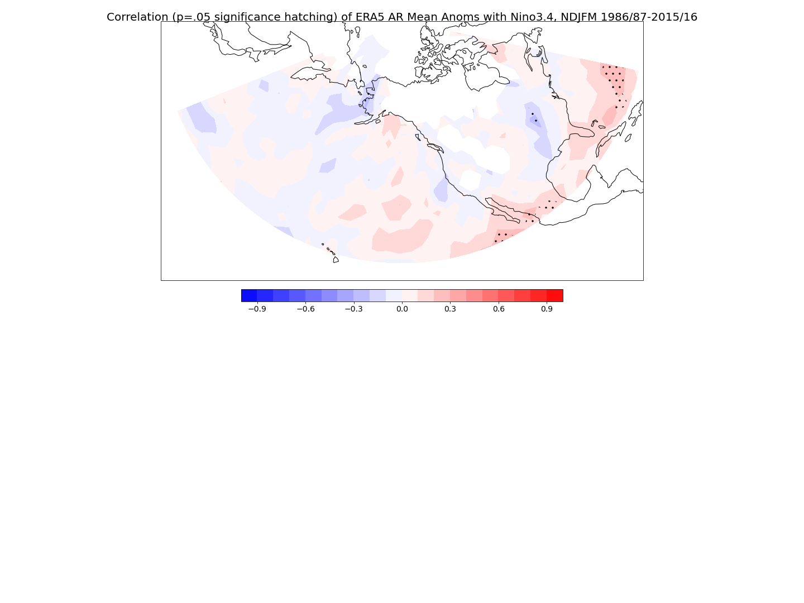
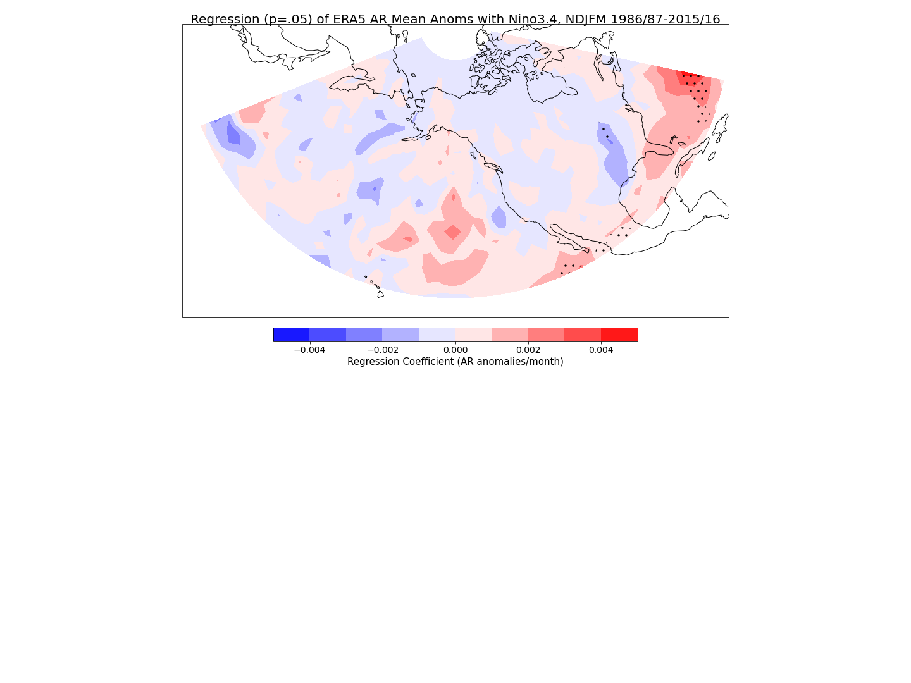

## Rivers in the Sky: Exploring Wintertime Moisture Flux over Pacific-North America

## Mary Korendyke

## Introduction

Atmospheric rivers are long, narrow bands of poleward moisture transport. They commonly occur over oceans, and are associated with extreme precipitation events when they make landfall. Potential skill in predicting atmospheric river statistics could help in predicting such extreme events. By associating atmospheric river statistics with planetary scale, persistent pressure patterns, the potential predictability of these patterns, or regimes, can be applied to atmospheric river statistics. This could potentially enhance atmospheric river prediction skill beyond the ten-day forecast limit. Here, we briefly investigate the climatology of moisture flux, the regime dependent atmospheric river anomalies from wintertime climatology, and how the atmospheric river wintertime anomalies are influenced by climate indices. Additionally, we look at how well the wintertime atmospheric river anomalies are modelled using forecasts run on an ECMWF coupled model.

## Data

ERA5 reanalysis and Metis199. ERA5 provides winds and specific humidity at x levels, so that vertically integerated moisture flux must be calculated using the same levels as exist in the EMCWF model used to create Metis forecasts. Metis forecasts come with column-integrated moisture flux already calculated, and are run at tco199 (100km) resolution. All data is interpolated to a Gaussian grid (128x64), in km.

[ERA5 documentation](https://www.ecmwf.int/en/forecasts/datasets/reanalysis-datasets/era5)

## Results/Code

Atmospheric rivers are calculated by first identifying the appropriate moisture flux magnitude threshold. We use 259kg/ms as this threshold, as it is the top 10% of ERA5 moisture flux magnitude values in the PacNA extended boreal winter. Once the threshold is identified, we take all consecutive points that qualify and group them into objects. We test for whether:

1. Length of object > 2000 km
2. Width of object < 1000 km
3. Net flux over object is northward

Only objects that fulfill all three criteria are atmospheric rivers.

[Atmospheric river identification](https://github.com/mkorendyke/CLIM680/blob/master/AR_notrack_2.ipynb)

### Climatology
This shows the moisture flux magnitude climatology in the PacNA region over all months. We can see that the moisture flux magnitude is strongest during the boreal summer, and weakest during the boreal winter. The moisture flux is most intense over the oceans and southeast US. The moisture flux maximum also appears to shift latitudinally. During the summer, the bands of moisture flux are further north, while during the winter, the bands are further south. 

[Monthly Climatology of ERA5 Vertically Integrated Moisture Flux](https://github.com/mkorendyke/CLIM680/blob/master/hw2.ipynb)

[Calculating Climatology and Anomalies of PacNA Atmospheric Rivers, 1986-2015, NDJFM](https://github.com/mkorendyke/CLIM680/blob/master/AR_notrack_3.calcanoms.ipynb)

### Winter-time Cluster Anomalies
We focus on the wintertime atmospheric river anomalies as the larger scale pressure patterns have more potential predictability in the winter than in the summer. The patterns, or regimes, were calculated as a part of current research using a simple k-means clustering machine learning algorithm on the PCA of geopotential height anomalies. They are used here to sort the atmospheric river anomalies by time into the appropriate regime. Composites were then calculated. The total number of atmospheric rivers that occurred over all years in the given regime are shown in contours. The anomalous number of times the atmospheric river occurred (with respect to climatology) is shown by the shading. 

The different regimes demonstrate different atmospheric river patterns. The Pacific Wavetrain narrows atmospheric river occurrence over the Pacific and decreases the number of rivers over the Atlantic. In the Arctic Low, rivers are shifted northward and occur more often in the Pacific, and there are more occurrences over the Atlantic as well. The Pacific Trough shifts rivers in the Pacific southward, and decreases the number over the SE US. The Arctic High increases the number of occurrences over the Pacific and the Atlantic. The Alaskan Ridge shifts the rivers away from the central Pacific, and increases the number of occurrences in the SE US.

[Assign AR Anomalies to Regimes](https://github.com/mkorendyke/CLIM680/blob/master/AR_notrack_4.assign_clusters.ipynb)

[Plot Regime AR Anomaly Composites](https://github.com/mkorendyke/CLIM680/blob/master/AR_notrack_5.plot_composites.ipynb)

We look at how well the regime-dependent atmospheric river anomalies are captured by forecast models by examining the results from the Metis199 and comparing with the ERA5 results. The Arctic Low displays the most points where significant difference occurs, while the Alaskan Ridge and Arctic High appear to be the least significantly different. The model appears to overestimate the number of atmospheric rivers that occur in the Arctic Low. Pacific Wavetrain shows significant difference in where the atmospheric river anomalies occur in the eastern Pacific. The model seems to underestimate atmospheric river anomalies in the Pacific Trough. Generally, the west coast and the Pacific have some issues with model representation across all regimes. The SE US and Atlantic demonstrate issues in Arctic Low and Pacific Trough regimes specifically.

[Calculate Differences and Demonstrate Significance Between Model and ERA5](https://github.com/mkorendyke/CLIM680/blob/master/AR_anom_diffs.ipynb)

### Atmospheric Rivers, the PNAI, and Nino3.4

The monthly means of the atmospheric river anomalies are compared with the monthly means of climate indices.

First, the PNA index. Positive PNA phase is defined as the PNA index > 1. Negative PNA phase is defined as the PNA index < -1. We identifed the AR anomaly means for each month where the mean PNAI fit this criteria, and created composites. In the positive PNA phase, there is a slight decrease in atmospheric rivers along the west coast. In the negative PNA phase, we see a stronger signal. The number of atmospheric rivers is decreased in the west Pacific, and there is an eastward shift in the SE US. 

[ERA5 November to March Atmospheric River Anomalies Composited on the Pacific North America Index](https://github.com/mkorendyke/CLIM680/blob/master/hw3.ipynb)

We correlated the monthly means of the atmospheric river anomalies with the Nino3.4 index. There is a significant weak positive correlation over the southwest coast and the Atlantic, and a significant weak negative correlation over mid-eastern US, indicating that when it's an El Nino year, there is some correlation with more atmospheric rivers striking the western coast of Mexico.

We also regressed the monthly means of the atmospheric river anomalies with the Nino3.4 index. Despite weak correlation, there does not appear to be a linear relationship between atmospheric river anomalies and ENSO, at least not one strong enough to be worth mentioning.

[ERA5 vs Nino34 (correlation and regression)](https://github.com/mkorendyke/CLIM680/blob/master/AR_Nino34.ipynb)

## Summary
In the PacNA region, moisture flux magnitude, and therefore the atmospheric rivers, have a seasonal dependency. There are weaker atmospheric rivers that occur further south in the winter than the stronger rivers in the summer. Regimes influence atmospheric rivers over the Pacific, Atlantic, and SE US. The rivers are more affected by the PNA negative phase than the positive one. While the river anomalies are weakly correlated with Nino3.4, there is no linear relationship between the anomalies and ENSO.
